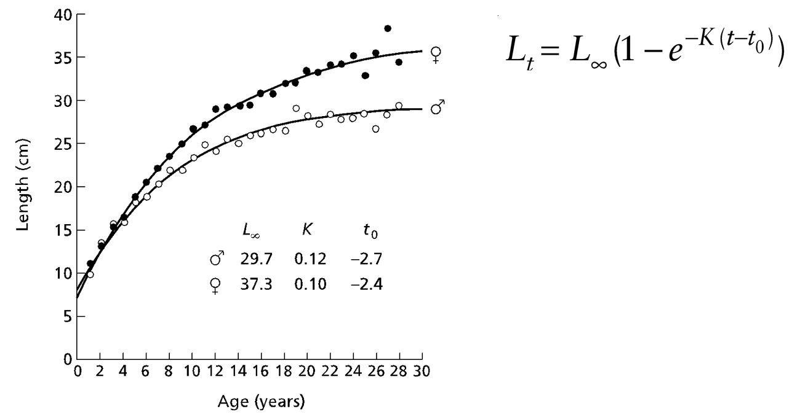

```{r setup, include=FALSE}
knitr::opts_chunk$set(echo = TRUE)
lab_path = dirname(rstudioapi::getSourceEditorContext()$path)
knitr::opts_knit$set(root.dir = lab_path)
getwd()
set.seed(9999)
require(FSAdata) 
require(FSA) # you may need to install this package
require(tidyverse)
require(rfishbase)
```
**Plot like you are turning in a professional fisheries report**
1) Use these `FSA` database to visualize life history patterns and growth curves. Label your axes.

`HerringBWE` Stock and recruitment data for Blackwater Estuary Herring (Clupea harengus), 1962-1997 spawning years.
- plot `spawning stock biomass` vs. `year`
- fit a linear regression (transform the data with `log`)
- plot `spawning stock biomass` per `recruit` vs `year`
- plot residuals

```{r}
lm1 = lm(log(HerringBWE$ssb)~log(HerringBWE$spawning.year))
p1 = ggplot() + geom_point(data=HerringBWE, aes(x=log(spawning.year), y=log(ssb))) + geom_line(data=HerringBWE, aes(x=log(spawning.year), y=predict(lm1))) + xlab("log spawning year") + ylab("spawning stock biomass (tons)") + ggtitle("SSB vs Spawning year of Blackwater Estuary Herring")
lm2 = lm(data=HerringBWE, log(ssb/recruits)~log(spawning.year))
p2 = ggplot() + geom_point(data=HerringBWE, aes(x=log(spawning.year), y=log(ssb/recruits))) + geom_line(data=HerringBWE, aes(x=log(spawning.year), y=predict(lm2))) + xlab("log spawning year") + ylab("spawning stock biomass per recruit (tons)") + ggtitle("SSB vs Spawning year of Blackwater Estuary Herring")

```
```{r}
p1
```
```{r}
p2
```
```{r}
par(mfrow=c(2,2))
plot(lm2)
```


`BlackDrum2001` Biological data (lengths, weights, ages from otoliths, and sex) for Black Drum (Pogonias cromis) from Virginia waters of the Atlantic Ocean, 2001. (TL mm). *HINT* you might need to remove `NA` values when fitting regression models.

- plot `Weight` (kg) vs. `Length` (mm) 
- model their linear and non-linear relationship (**NOTE** for non-linear, use `nls` and the weight at length equation)
- show both fitted plots next to each other

```{r}
BlackDrum2001_new = na.omit(BlackDrum2001)
blm1 = lm(data=BlackDrum2001_new, log(weight)~log(tl))

p1 = ggplot() + geom_point(data=BlackDrum2001_new, aes(x=log(tl), y=log(weight))) + geom_line(data=BlackDrum2001_new, aes(x=log(tl), y=predict(blm1))) + xlab("log total length (mm)") + ylab("log weight (kg)") + ggtitle("Weight vs Length of Atlantic Black Drum")
# ggplot() + geom_point(data=BlackDrum2001_new, aes(x=weight, y=tl))
```
```{r}
model_bd = nls(weight~a*tl^b, start=list(a=160,b=3), data=BlackDrum2001_new)
p2 = ggplot() + geom_point(data=BlackDrum2001_new, aes(x=tl, y=weight)) + geom_line(data=BlackDrum2001_new, aes(x=tl, y=predict(model_bd))) 
```
`Bonito` Ages and length (cm) measurements of Australian Bonito (Sarda australis). 
- plot `Length` vs `Age`, add `Sex` as a categorical variable
- fit VBGF curves to both sexes on the same plot (picture for example)

```{r pressure, echo=FALSE, fig.cap="A caption", out.width = '100%'}

```

```{r}
vb = vbFuns(param="Typical") # from FSA package
```

```{r}
Bonito_f = subset(Bonito, sex=="Female")
Bonito_m = subset(Bonito, sex=="Male")

f.starts_f <- vbStarts(fl~age,data=Bonito_f) # vbStarts is an optimization algorithm designed to find the best params
f.fit_f <- nls(fl~vb(age,Linf,K,t0),data=Bonito_f,start=f.starts_f)

f.starts_m <- vbStarts(fl~age,data=Bonito_m) # vbStarts is an optimization algorithm designed to find the best params
f.fit_m <- nls(fl~vb(age,Linf,K,t0),data=Bonito_m,start=f.starts_m)

ggplot() + geom_point(data=Bonito, aes(x=age, y=fl, color=sex)) + 
  scale_color_manual(values=c("red", "grey", "blue")) + xlab("Age (years)") + ylab("Fork Length (cm)") + geom_line(data=Bonito_f, aes(x=age, y=predict(f.fit_f)), color="red") + geom_line(data=Bonito_m, aes(x=age, y=f.fit_m$m$fitted()), color="blue")

```

## Question
Using VBGF, what is the predicted length (cm) of a 1.5 year old *female* Bonito?
$$
L(a) = L_{inf}(1-e^{(-k(a-t_0))})
$$

```{r}

```

2) Growth Modeling
- plot an exponential growth model for a stock with `initial population size of 1500`, an `annual death rate of 0.07`, and an `annual harvest (catch) of 100` individuals. Compare the effects of different `birth rates b=0.15, b=0.2, and b=0.25` on the population trajectory. Project the population growth over `30 years`.  

```{r}

```

3) Calculate the maximum growth rate of `North Sea Haddock` (`Melanogrammus aeglefinus`) using the functions below. 
*Parameters that we need*
- Lifespan
- Fecundity
- Age at Maturation
```{r}
# ---- Mortality rate ----------------------------

# get mortality from Then.etal.2014
getMtmax = function(lifespan){		
		M = 4.899 * lifespan^-0.916
		M
}

# get mortality using Dulvy.etal.2004's method
getMDulvy.etal.2004 = function(lifespan, agemat){
	w = (lifespan+agemat)/2 # average lifespan
	M = 1/w
	M
}

getRmax= function(method = "Smith.etal.1998", mortality = "Then.etal.2014", fec = NULL, litter = NULL, cycle = NULL, lifespan, agemat){

  # Calculate natural mortality rate
	if (mortality== "Dulvy.etal.2004") M = getMDulvy.etal.2004(lifespan = lifespan, agemat = agemat)
	if (mortality== "Then.etal.2014") M = getMtmax(lifespan = lifespan)
	if (is.numeric(mortality)) M = mortality

	if(method=="Smith.etal.1998"){
		tmax = lifespan
		tmat = agemat
		if (is.null(fec)) fec = litter/2/cycle else fec = fec
		Z<-1.5*M
	
		#this is equation 7 in the manuscript
		l_alpha<-(1-exp(-(Z)))/((fec)*(1-exp(-(Z*(tmax-tmat+1)))))

		#this is equation 6 in the manuscript
		eq6 <- function(reb) 1-exp(-(M+reb))-l_alpha*(fec)*1.25*exp(-reb*tmat)*(1-exp(-(M+reb)*(tmax-tmat+1)))
		r_Z<-uniroot(eq6, c(0,5), tol=1e-8)
		return(r_Z$root*2)
	} 
	
}
```

```{r}

```
